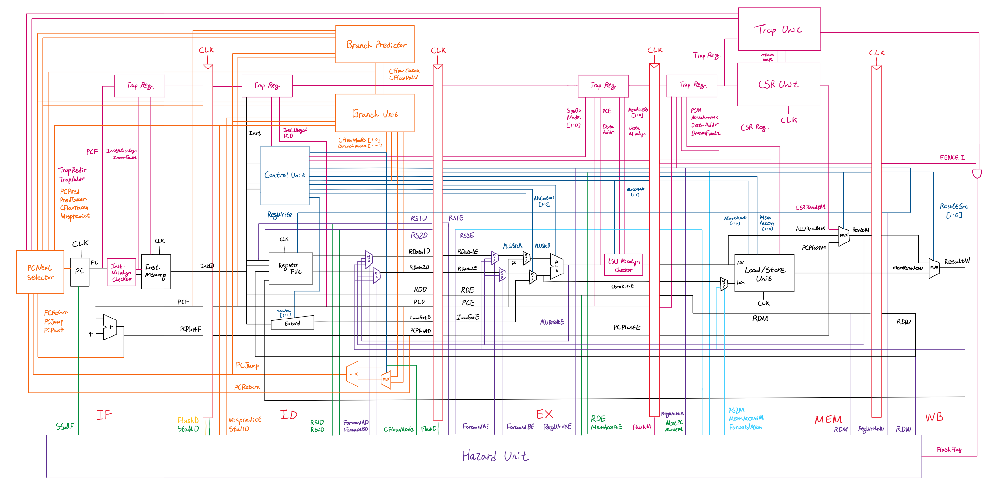

# RISC-V CPU

A 5-stage pipelined RISC-V processor core implementation in SystemVerilog, designed for FPGA deployment.

## Features

### ISA Support
- **Base ISA**: RV32I (RISC-V 32-bit Integer Base Instruction Set)
- **Extensions**:
  - **M**: Integer Multiplication and Division
  - **Zicsr**: Control and Status Register (CSR) Instructions
  - **Zifencei**: Instruction-Fetch Fence (FENCE.I)

### Microarchitecture

- **Pipeline**: 5-stage (Fetch, Decode, Execute, Memory, Writeback)
- **Branch Resolution**: Early branch resolution in ID stage
  - Dedicated PCJump generator in ID stage (supports JAL, JALR, Branch)
  - PCSrc MUX in IF stage selects between PC+4, Jump target, and Trap redirect
- **Hazard Handling**:
  - Data forwarding for RAW hazards from EX, MEM, and WB stages to ID and EX
  - Store-data forwarding to resolve memory data hazards (MEM/WB)
  - Load-use hazard detection with 1 to 2 cycle pipeline stall
  - Branch misprediction recovery with pipeline flush
- **Trap/Exception Support**:
  - ECALL, EBREAK, MRET
  - Illegal Instruction
  - Instruction/Data Address Misalign
  - Instruction/Data Access Fault

## Clock Domain and Reset

### Clock and Reset Signals
| Signal | Type | Description |
|--------|------|-------------|
| `clk`  | Input | System clock (tested at 100 MHz) |
| `rstn` | Input | Active-low asynchronous reset |
| `start`| Internal | Synchronous start signal (derived from `rstn`) |

### Clock Parameters
- **Clock Period**: 10 ns (100 MHz target frequency)
- **Timescale**: 1ns/1ps

### Reset Behavior
1. `rstn` is asserted low for reset
2. `start` signal is generated internally by registering `rstn`
3. All pipeline stages flush on reset
4. Program Counter resets to address 0x00000000
5. All registers clear to zero

## Memory Specifications

### Instruction Memory (IMEM)
- **Size**: 16 KB (4096 words)
- **Width**: 32-bit
- **Access**: Read-only during execution
- **Operations**: Loaded from `program.hex` at startup

### Data Memory (DMEM)
- **Size**: 64 KB (16384 words)
- **Width**: 32-bit
- **Access**: Byte, half-word, and word addressable
- **Operations**: Load/Store with alignment checking

**Note**: Both memories are designed assuming FPGA synchronous Block RAM. The 1-cycle latency is naturally absorbed by the pipelined architecture.

## Performance Characteristics

### Pipeline Performance
- **Ideal CPI**: 1.0 (one instruction per cycle in steady state)
- **Actual CPI**: Depends on program characteristics (typically 1.1-1.5 due to hazards)

### Hazard Penalties
| Hazard Type | Penalty (Cycles) | Detection Stage | Notes |
|-------------|------------------|-----------------|-------|
| **Data Hazard (RAW)** | 0 | ID/EX | Resolved by forwarding from EX/MEM/WB stages |
| **Load-Use Hazard (Basic)** | 1 | ID | Detect on ID → use in EX (next cycle) |
| **Load-Use Hazard (Branch)** | 2 | ID | Detect on ID → use in ID (same cycle) |
| **Store-Data Hazard** | 0 | MEM | Resolved by forwarding from WB stage |
| **Branch Misprediction** | 1 | ID | Flush IF stage, redirect PC |
| **Jump (JAL/JALR)** | 1 | ID | Unconditional redirect, flush IF stage |

### Trap/Exception Penalties
| Trap/Flush Type | Penalty (Cycles) | Processing Stage | Notes |
|-----------------|------------------|------------------|-------|
| **All Traps** | 3 | MEM | Flush IF, ID, EX stages, redirect to mtvec |
| **MRET** | 3 | MEM | Flush IF, ID, EX stages, restore PC from mepc |
| **FENCE.I** | 3 | MEM | Flush IF, ID, EX stages, instruction memory sync |

## Supported Instructions

### RV32I Base Integer Instructions
- **Arithmetic**: ADD, SUB, AND, OR, XOR, SLL, SRL, SRA, SLT, SLTU
- **Immediate Arithmetic**: ADDI, ANDI, ORI, XORI, SLLI, SRLI, SRAI, SLTI, SLTIU
- **Load**: LB, LH, LW, LBU, LHU
- **Store**: SB, SH, SW
- **Branch**: BEQ, BNE, BLT, BGE, BLTU, BGEU
- **Jump**: JAL, JALR
- **Upper Immediate**: LUI, AUIPC
- **System**: ECALL, EBREAK, MRET

### M Extension (Multiply/Divide)
- **Multiply**: MUL, MULH, MULHSU, MULHU
- **Divide**: DIV, DIVU, REM, REMU

### Zicsr Extension
- CSRRW, CSRRS, CSRRC
- CSRRWI, CSRRSI, CSRRCI

### Zifencei Extension
- FENCE.I (instruction cache flush)

## CSR Registers

The core implements the following Machine-mode CSRs:

| CSR Address | Name | Description |
|-------------|------|-------------|
| 0x300 | **mstatus** | Machine status register (MIE, MPIE bits) |
| 0x304 | **mie** | Machine interrupt-enable register |
| 0x305 | **mtvec** | Machine trap-handler base address (default: 0x40) |
| 0x340 | **mscratch** | Machine scratch register for trap handlers |
| 0x341 | **mepc** | Machine exception program counter |
| 0x342 | **mcause** | Machine trap cause |
| 0x343 | **mtval** | Machine trap value (bad address or instruction) |
| 0x344 | **mip** | Machine interrupt-pending register |
| 0xF14 | **mhartid** | Hardware thread ID (read-only, hart ID = 0) |

## License
See `LICENSE` file for details.

## Contributors
Developed as part of a RISC-V CPU design project.
