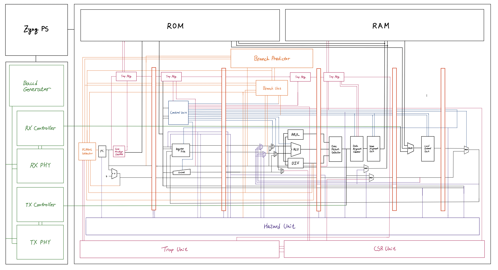

# RISC-V CPU

A 6-stage pipelined RISC-V processor core designed for FPGA deployment, featuring an integrated UART controller for system programming and debugging. Achieved **263.7 CoreMark** and **91.0 DMIPS** at 100 MHz.
  
## Features

### ISA Support
- **Base ISA**: RV32I (RISC-V 32-bit Integer Base Instruction Set)
- **Extensions**:
  - **M**: Integer Multiplication and Division
  - **Zicsr**: Control and Status Register (CSR) Instructions
  - **Zifencei**: Instruction-Fetch Fence (FENCE.I)

### Microarchitecture


- **Pipeline**: 6-stage (Fetch, Decode, Execute, Memory 1, Memory 2, Writeback)
  - **MEM1**: Memory Access & Store Align
  - **MEM2**: Data Ready (FPGA BRAM Latency) & Load Data Extend
- **Branch Prediction**:
  - **BHT (Branch History Table)**: 256 entries. Uses a 2-bit Saturating Counter (Strongly/Weakly Taken/Not Taken) to predict conditional branches. Implemented as LUTRAM.
  - **BTB (Branch Target Buffer)**: 256 entries. Stores Valid bit, Entry Type (Branch, Jump, Return), Tag, and Target Address. Implemented as LUTRAM.
  - **RAS (Return Address Stack)**: 32 entries. Push on JAL/JALR with call hint (`CFHINT_CALL`); pop on JALR with return hint (`CFHINT_RET`). Supports nested function calls.
  - **Prediction Logic**: For branches, `pred_taken = bht_taken && btb_hit`; for JAL/JALR, `pred_taken = btb_hit`. No pipeline stalls or flushes on a correct prediction.
- **Branch Resolution**:
  - **Branch Unit**: Resolution & validation in EX stage. Registers inputs for timing optimization (1-cycle latency).
  - **Recovery**: 3-cycle penalty on misprediction (Flush ID/EX/MEM1, redirect PC)
- **Hazard Handling**:
  - RAW hazards resolved by forwarding from MEM1/MEM2/WB to EX
  - Store-Data hazards resolved by forwarding from WB to MEM1
  - Load-Use hazards resolved by 2-cycle pipeline stall + WB to EX forwarding
  - Branch Misprediction resolved by pipeline flush
- **Trap/Exception Support**:
  - ECALL, EBREAK, MRET
  - Illegal Instruction
  - Instruction/Data Address Misalign
  - Instruction/Data Access Fault
- **Hardware Multiplier & Divisor**:
  - **Multiplier**: Implemented using inferred DSP blocks (via `(* use_dsp = "yes" *)` synthesis attribute).
  - **Divisor**: Implemented using a custom iterative shift-subtract logic (2x loop unrolled, 16 cycles for 32-bit division).

## Clock Domain and Reset

### Target FPGA
- **Board**: ALINX AX7Z020B (Zynq-7020)
- **Input Clock**: 50 MHz (onboard oscillator)
- **Internal Clock**: 100 MHz (via MMCM)

### Clock and Reset Signals
| Signal | Type | Description |
|--------|------|-------------|
| `clk`  | Input | System clock |
| `rstn_push` | Input | Active-low asynchronous reset (Button, synchronized with 2-FF + debounce) |
| `uart_rx` | Input | UART Receive Data |
| `uart_tx` | Output | UART Transmit Data |
| `rstn_led` | Output | Reset status LED (active when reset asserted) |
| `start_led` | Output | CPU run status LED (active when CPU running) |

### Reset Behavior
1.  **Hard Reset**: Physical button or MMCM lock.
2.  **Soft Reset**: Controlled via UART commands during programming.
3.  **Initialization**: PC resets to `0x00000000`, pipeline flushes.

## Memory Specifications

### Memory Map
| Region | Base Address | Size | Description |
|--------|-------------|------|-------------|
| **IMEM** | `0x00000000` | 128 KB | Instruction Memory |
| **DMEM** | `0x00020000` | 128 KB | Data Memory |
| **Stack Top** | `0x00040000` | — | Top of DMEM (stack grows downward) |
| **PRINT** | `0xFFFF0000` | — | MMIO: UART TX output (write) |
| **INPUT** | `0xFFFF0004` | — | MMIO: UART RX input (read) |

### Instruction Memory (IMEM)
- **Size**: 128 KB (32768 words)
- **Width**: 32-bit
- **Access**: Read-only; writable via UART programmer (runtime, without FPGA reconfiguration)

### Data Memory (DMEM)
- **Size**: 128 KB (32768 words)
- **Width**: 32-bit
- **Access**: Read/Write (byte-enable write strobe)
- **IO Mapping**:
  - Writes to `0xFFFF_0000` (`PRINT_ADDR`) with `data[8] == 0` → `RES_PRINT` via UART TX.
  - Writes to `0xFFFF_0000` with `data[8] == 1` → `RES_EXIT` with `data[7:0]` as exit code.
  - Reads from `0xFFFF_0004` (`INPUT_ADDR`) → returns `input_data` if RX FIFO non-empty, else `0xFFFFFFFF`. Polled by `getchar()` in syscalls.
- **Access Fault**: Accesses outside the DMEM range (other than `PRINT_ADDR` and `INPUT_ADDR`) trigger a Data Access Fault trap.

## Performance Characteristics

### CoreMark Benchmark

Measured on Zynq-7020 FPGA running at 100 MHz (RV32IM, `-O2`, `ITERATIONS=3000`).

| Metric | Value |
|--------|-------|
| **CoreMark Score** | 263.7 |
| **CoreMark/MHz** | 2.64 |

---

### Dhrystone 2.2 Benchmark

Measured on Zynq-7020 FPGA running at 100 MHz (RV32IM, `-O2`, `NUMBER_OF_RUNS=100000`).

| Metric | Value |
|--------|-------|
| **Dhrystones/Second** | 160000 |
| **DMIPS** | 91.0 |
| **DMIPS/MHz** | 0.91 |

> DMIPS = Dhrystones/Second ÷ 1,757 (VAX 11/780 reference = 1 DMIPS)

---

### Hardware Multiplier & Divisor

**Multiplier**
- Inferred DSP48 blocks via `(* use_dsp = "yes" *)` synthesis attribute.
- 3-stage pipeline: result available 3 cycles after issue, causing a **3-cycle stall** (`MUL_COUNT = 3`).

**Divisor**
- Algorithm: Shift-compare-subtract. Handles signed/unsigned division and remainder, with special-case handling for divide-by-zero and signed overflow.
- 2x loop unrolled: computes **2 quotient bits per clock cycle** combinatorially.
- 32-bit division takes **17 cycles** total (1 setup + 16 compute), causing a **17-cycle stall** (`DIV_COUNT = 17`, `SHIFT_COUNT = 16`).

### Pipeline Performance
- **Ideal CPI**: 1.0
- **Actual CPI**: Depends on program characteristics (typically 1.1–1.5 due to hazards)

### Hazard Penalties
| Hazard Type | Penalty (Cycles) | Detection Stage | Notes |
|-------------|------------------|-----------------|-------|
| **Data Hazard (RAW)** | 0 | EX | Forwarding from MEM1/MEM2/WB to EX. Loads are excluded from MEM1/MEM2 path. |
| **Store-Data Hazard** | 0 | MEM1 | Forwarding from WB to MEM1 store data register |
| **Load-Use Hazard** | 2 | ID | Stall while load is in EX (`id_ex`) and again in MEM1 (`id_mem1`); 2 bubbles total; result forwarded from WB→EX |
| **Branch Prediction Hit** | 0 | IF | Zero penalty (Seamless execution) |
| **Branch Prediction Miss** | 3 | EX | Flush ID/EX/MEM1 stages; redirect PC to correct target |
| **Multiplication Stall** | 3 | EX | Pipeline stall during multiplication |
| **Division Stall** | 17 | EX | Pipeline stall during division |

### Trap/Exception Penalties
| Trap/Flush Type | Penalty (Cycles) | Processing Stage | Notes |
|-----------------|------------------|------------------|-------|
| **All Traps** | 3 | MEM1 | Flush ID/EX/MEM1/MEM2 stages, redirect to mtvec |
| **MRET** | 3 | MEM1 | Flush ID/EX/MEM1/MEM2 stages, restore PC from mepc |
| **FENCE.I** | 3 | MEM1 | Flush ID/EX/MEM1/MEM2 stages, instruction memory sync |

## Supported Instructions

### RV32I Base Integer Instructions
- **Arithmetic**: ADD, SUB, AND, OR, XOR, SLL, SRL, SRA, SLT, SLTU
- **Immediate Arithmetic**: ADDI, ANDI, ORI, XORI, SLLI, SRLI, SRAI, SLTI, SLTIU
- **Load**: LB, LH, LW, LBU, LHU
- **Store**: SB, SH, SW
- **Branch**: BEQ, BNE, BLT, BGE, BLTU, BGEU
- **Jump**: JAL, JALR
- **Upper Immediate**: LUI, AUIPC
- **System**: ECALL, EBREAK, MRET, WFI (Hint, NOP)

### RV32M Standard Extension
- **Multiplication**: MUL, MULH, MULHSU, MULHU
- **Division**: DIV, DIVU, REM, REMU

### Other Extensions
- **Zicsr**: CSRRW, CSRRS, CSRRC, CSRRWI, CSRRSI, CSRRCI
- **Zifencei**: FENCE.I (Instruction cache/pipeline flush)

## CSR Registers

### Machine-Mode CSRs

| CSR Address | Name | Description |
|-------------|------|-------------|
| 0x300 | **mstatus** | Machine status register (MIE, MPIE bits) |
| 0x304 | **mie** | Machine interrupt-enable register |
| 0x305 | **mtvec** | Machine trap-handler base address (default: `0x400`) |
| 0x340 | **mscratch** | Machine scratch register for trap handlers |
| 0x341 | **mepc** | Machine exception program counter |
| 0x342 | **mcause** | Machine trap cause |
| 0x343 | **mtval** | Machine trap value (bad address or instruction) |
| 0x344 | **mip** | Machine interrupt-pending register |
| 0xB00 | **mcycle** | Cycle counter (lower 32 bits), auto-incremented every clock cycle |
| 0xB80 | **mcycleh** | Cycle counter (upper 32 bits) |
| 0xB02 | **minstret** | Instructions-retired counter (lower 32 bits), incremented per retired instruction |
| 0xB82 | **minstreth** | Instructions-retired counter (upper 32 bits) |

### Read-Only CSRs

| CSR Address | Name | Description |
|-------------|------|-------------|
| 0xF14 | **mhartid** | Hardware thread ID (hart ID = 0) |
| 0xC00 | **cycle** | Alias for mcycle (lower 32 bits) |
| 0xC80 | **cycleh** | Alias for mcycleh (upper 32 bits) |
| 0xC02 | **instret** | Alias for minstret (lower 32 bits) |
| 0xC82 | **instreth** | Alias for minstreth (upper 32 bits) |

## UART Subsystem

Integrated UART controller for communication and system control.

- **System Programmer**: Loads compiled programs (`.hex`) into Instruction Memory.
- **Standard Output**: MMIO-based character output for debugging.

### Protocol Specification

#### 1. Configuration

| Parameter | Value |
|:---|:---|
| **Baud Rate** | 115200 bps |
| **Data Bits** | 8 bits |
| **Stop Bits** | 1 bit |
| **Parity** | None |
| **Oversampling** | 16x |

#### 2. Packet Structure

**RX Packet (Host → FPGA)**

| START | CMD | LEN | PAYLOAD | CHECKSUM |
| :---: | :---: | :---: | :---: | :---: |
| 0xA5 | 1B | 1B | 0~252B | 1B |

- **Payload**: `CMD_WRITE` — Address (4B) + Data (nB), little-endian.
- **Checksum**: Sum of all bytes (START through last PAYLOAD byte), truncated to 8 bits.

**TX Packet (FPGA → Host)**

| START | RES | LEN | PAYLOAD | CHECKSUM |
| :---: | :---: | :---: | :---: | :---: |
| 0xA5 | 1B | 1B | 0~1B | 1B |

#### 3. Commands (CMD)

| Command | Code | Description | Payload |
|:---:|:---:|:---|:---|
| **CMD_RESET** | 0x01 | Halt and reset CPU | None |
| **CMD_WRITE** | 0x02 | Write to memory | Addr(4B) + Data |
| **CMD_RUN**   | 0x03 | Start execution | None |
| **CMD_INPUT** | 0x04 | Send stdin data to CPU RX FIFO | Data (nB) |

#### 4. Responses (RES)

| Response | Code | LEN | Payload | Description |
|:---:|:---:|:---:|:---|:---|
| **RES_ACK**   | 0x06 | 0 | None | Command acknowledged |
| **RES_NAK**   | 0x15 | 0 | None | Command rejected |
| **RES_BOOT**  | 0x80 | 0 | None | CPU started (sent once on `CMD_RUN`) |
| **RES_EXIT**  | 0x81 | 1 | Exit code (1B) | Program exited via `_exit()` |
| **RES_PRINT** | 0x82 | 1 | Character (1B) | MMIO character output |

#### 5. Boot Sequence
1. Host sends `CMD_RUN`.
2. CPU begins execution and immediately sends `RES_BOOT` (hardware-generated via `boot_flag`).
3. Host enters CPU Console; keyboard input becomes active (line-buffered, sent as `CMD_INPUT`).
4. User program output follows as `RES_PRINT` packets; `getchar()`/`scanf()` in the program poll `INPUT_ADDR`.
5. On `_exit(code)`, CPU sends `RES_EXIT` with the exit code.

## Software & Tools

> **Note**: The programmer tool is **Windows-specific** due to Win32 API usage (`CreateFileA`, `ReadFile`, `WriteFile`, etc.).

### Directory Structure
```
Software/
├── runtime/        # Common bare-metal runtime (shared by all apps)
│   ├── crt0.S          # Startup code: sp init, BSS clear, main call, trap handler
│   ├── linker.ld       # Linker script: IMEM @ 0x0, DMEM @ 0x20000, stack @ 0x40000
│   ├── syscalls.c      # MMIO syscalls: putchar, printf, sprintf, _exit, memcpy, etc.
│   └── common.mk       # Shared Makefile rules (compile, link, hex generation)
├── apps/           # Application source code
│   ├── firmware/       # Custom test firmware
│   ├── coremark/       # CoreMark benchmark
│   ├── dhrystone/      # Dhrystone benchmark
│   └── riscv-tests/    # Official RISC-V test suite (submodule)
├── build/          # Compiled output (per-app subdirectories)
│   ├── firmware/       # firmware.hex, firmware.elf, *.o
│   ├── coremark/       # coremark.hex, coremark.elf, *.o
│   ├── dhrystone/      # dhrystone.hex, dhrystone.elf, *.o
│   └── riscv-tests/    # add.hex, lw.hex, mul.hex, ...
└── programmer/     # Host-side UART programming tool (Windows)
```

### Toolchain Requirements
- **Compiler**: `riscv-none-elf-gcc`
- **Architecture**: `rv32im_zicsr_zifencei`
- **ABI**: `ilp32`
- **Compiler Flags**: `-O2 -nostdlib -nostartfiles -ffreestanding`

---

### `runtime/` — Common Bare-Metal Runtime

Shared startup and syscall code used by all applications.

| File | Description |
|------|-------------|
| `crt0.S` | Startup code: initializes `sp` to stack top (`0x40000`), clears `.bss`, installs trap handler, calls `main` then `_exit` |
| `linker.ld` | Linker script: IMEM @ `0x00000000`, DMEM @ `0x00020000`, stack top @ `0x00040000` |
| `syscalls.c` | Bare-metal syscall and standard library implementation (MMIO-based I/O, string utilities, timer functions) |
| `common.mk` | Shared build rules: compile `.c`/`.S`, link `.elf`, generate `.hex` via `objcopy` |

#### Supported Functions

**I/O**

| Function | Signature | Description |
|----------|-----------|-------------|
| `getchar` | `int getchar(void)` | Polls `INPUT_ADDR` until a byte is available, returns it as `int` |
| `putchar` | `int putchar(int c)` | Writes a character to `PRINT_ADDR` (UART TX) |
| `printf` | `int printf(const char *fmt, ...)` | Formatted output to UART TX; supports `%c`, `%s`, `%d`, `%i`, `%u`, `%x`, `%o`, `%p`, `%f`, `%l*`, width, `0`/`-` padding |
| `sprintf` | `int sprintf(char *str, const char *fmt, ...)` | Formatted output into a string buffer; same specifiers as `printf` |
| `scanf` | `int scanf(const char *fmt, ...)` | Reads input via `getchar()`; supports `%c`, `%s`, `%d`, `%i`, `%u`, `%x`, width for `%s` |
| `_exit` | `void _exit(int code)` | Sends `RES_EXIT` with exit code via `PRINT_ADDR`, then loops forever |

**String & Memory**

| Function | Signature | Description |
|----------|-----------|-------------|
| `memcpy` | `void *memcpy(void *dest, const void *src, size_t len)` | Copies `len` bytes from `src` to `dest` |
| `memset` | `void *memset(void *dest, int byte, size_t len)` | Fills `len` bytes of `dest` with `byte` |
| `strlen` | `size_t strlen(const char *s)` | Returns the length of string `s` |
| `strcmp` | `int strcmp(const char *s1, const char *s2)` | Lexicographic comparison of `s1` and `s2` |
| `strcpy` | `char *strcpy(char *dest, const char *src)` | Copies string `src` into `dest` |

**Timer**

| Function | Signature | Description |
|----------|-----------|-------------|
| `get_cycle` | `uint64_t get_cycle(void)` | Returns the 64-bit `mcycle` counter value |
| `time_us` | `uint32_t time_us(void)` | Returns elapsed microseconds based on `mcycle` (100 MHz) |
| `time_ms` | `uint32_t time_ms(void)` | Returns elapsed milliseconds based on `mcycle` (100 MHz) |

---

### `apps/firmware/` — Custom Test Firmware

A bare-metal test program written in C.

#### Files
| File | Description |
|------|-------------|
| `main.c` | User Program |
| `Makefile` | Sets `APP_NAME`, `APP_SRCS`, includes `../../runtime/common.mk` |

#### Build
```bash
cd Software/apps/firmware
make clean && make
```

---

### `apps/coremark/` — CoreMark Benchmark

Runs the [EEMBC CoreMark](https://github.com/eembc/coremark) benchmark (v1.0) on bare-metal RISC-V.

#### Files
| File | Description |
|------|-------------|
| `core_portme.h` | Platform configuration: `HAS_FLOAT=1`, 64-bit cycle counter (`rdcycle`/`rdcycleh`), `MEM_STATIC` |
| `core_portme.c` | Timing (`start_time`/`stop_time`/`get_time`/`time_in_secs`), seed variables, `ee_printf` via `vprintf` |
| `Makefile` | Sets `APP_NAME`, `APP_SRCS`, `ITERATIONS=3000`, `-DPERFORMANCE_RUN=1`, links `-lgcc` for soft-float |

#### Timer Mechanism
CoreMark timing uses the 64-bit `mcycle` hardware counter (100 MHz):
```c
start_time()  →  start_time_val = rdcycleh:rdcycle
stop_time()   →  stop_time_val  = rdcycleh:rdcycle
time_in_secs(ticks)  →  (double)ticks / 100000000.0
```

#### Build
```bash
cd Software/apps/coremark
make clean && make
```

> CoreMark requires ≥ 10 seconds of continuous execution for a valid result. At 263.769 CoreMark/s, `ITERATIONS=3000` gives ~11.4 seconds.

---

### `apps/dhrystone/` — Dhrystone Benchmark

Runs the classic Dhrystone 2.2 synthetic integer benchmark.

#### Files
| File | Description |
|------|-------------|
| `dhrystone.h` | Merged header: `HZ=100000000`, `CLOCK_TYPE="mcycle"`, `NUMBER_OF_RUNS=100000`; `Start_Timer`/`Stop_Timer` use `mcycle` CSR |
| `dhrystone.c` | Dhrystone auxiliary procedures (Proc_6~8, Func_1~3) |
| `dhrystone_main.c` | Dhrystone main benchmark loop and result output |
| `util.h` | Benchmark utilities: `setStats` declaration, `encoding.h` include guard |
| `encoding.h` | CSR access macros: `read_csr`, `write_csr` |
| `Makefile` | Sets `APP_NAME`, `APP_SRCS`, `EXTRA_CFLAGS`, includes `../../runtime/common.mk` |

#### Timer Mechanism
Dhrystone timing uses the `mcycle` hardware counter (100 MHz):
```c
Start_Timer()  →  Begin_Time = (long)read_csr(mcycle);
Stop_Timer()   →  End_Time   = (long)read_csr(mcycle);
```

#### Build
```bash
cd Software/apps/dhrystone
make clean && make
```

---

### `apps/riscv-tests/` — Official RISC-V Test Suite

RISC-V ISA compliance tests (git submodule).

#### Build
```bash
# Build a single test
cd Software/apps/riscv-tests
make TEST=add run

# Build all tests
make all-hex
# Output: Software/build/riscv-tests/*.hex
```

---

### `programmer/` — Host-Side UART Programming Tool

A Windows-only interactive command-line tool that communicates with the FPGA over UART.

#### Files
| File | Description |
|------|-------------|
| `programmer.c` | COM port setup, menu-driven command dispatch (RESET/BUILD/WRITE/RUN), `make` build integration, `.hex` parsing and chunked IMEM upload via `CMD_WRITE` |
| `programmer.h` | Constants (`CHUNK_SIZE=62`), command enum (`CMD_RESET/WRITE/RUN/INPUT`) |
| `serial_port.c` | Win32 serial port: open/close/read/write, frame receiver, CPU console; line-buffered keyboard input sent as `CMD_INPUT` after `RES_BOOT`; Ctrl+D exits |
| `serial_port.h` | Protocol constants (`START_FLAG=0xA5`, `TIMEOUT_MS=20000`), response enum |

#### Menu
```
1. RESET    Reset System
2. BUILD    Build Program Image  (invokes make, optional immediate write)
3. WRITE    Write Program Image
4. RUN      Run Program & CPU Monitor
5. EXIT     End Program
```

On `BUILD`, after a successful make, the tool asks:
```
Write Program Now? (Y/N):
```
If `Y`, it immediately uploads the freshly built `.hex` without re-selecting the image.

#### Protocol Constants
| Constant | Value | Description |
|----------|-------|-------------|
| `START_FLAG` | `0xA5` | Packet start byte |
| `CHUNK_SIZE` | `62` | Max words per `CMD_WRITE` packet (payload = 4 + 62×4 = 252 bytes) |
| `TIMEOUT_MS` | `20000` | Per-field receive timeout (20 seconds) |

#### Serial Port Settings
| Parameter | Value |
|-----------|-------|
| Baud Rate | 115200 |
| Byte Size | 8 |
| Stop Bits | 1 |
| Parity | None |
| Read Interval Timeout | 50 ms |
| Read Total Timeout | 50 ms + 10 ms × bytes |
| Write Total Timeout | 50 ms + 10 ms × bytes |

#### Build
```bash
cd Software/programmer
gcc programmer.c serial_port.c -o programmer.exe
```

---

### Typical Workflow

```bash
cd Software/programmer
programmer.exe
```

1. Enter COM port number (e.g., `3` for `COM3`)
2. `RESET` — Halt and reset CPU
3. `BUILD` — Build selected app, then optionally write immediately
4. `WRITE` — Upload selected `.hex` to IMEM
5. `RUN` — Start CPU and enter CPU Monitor (press `q` to exit)

## Simulation

### Vivado Simulator
This project relies on **Vivado Simulator (XSim)** for functional verification.

1.  **Setup**:
    - Add `RTL/Testbench/cpu_testbench.sv` to the project as a **Simulation Source**.
    - Set `cpu_testbench` as the **Top Module** in simulation settings.

2.  **Waveform**:
    - Add `Simulation/waveform.wcfg` to the simulation sources for pre-configured signal views.
    - This configuration includes grouped signals for each pipeline stage (IF, ID, EX, MEM, WB) and debug interfaces.

3.  **Execution**:
    - Run **Behavioral Simulation**.
    - The testbench prints `[BOOT]`, `[PASS]`, or `[FAIL: exit=N]` based on CPU events.

## Directory Structure

- `RTL/`: Top-level FPGA module (`riscv_cpu_fpga.sv`)
  - `Core/`: SystemVerilog source code for the RISC-V CPU Core
  - `UART/`: Source code for the UART controller and PHY
  - `Testbench/`: Simulation testbench files
- `Simulation/`: Waveform configuration files for Vivado Simulator
- `Software/`: Firmware, benchmarks, and host programming tool
  - `runtime/`: Common bare-metal runtime (shared by all apps)
  - `apps/`: Application source code (firmware, coremark, dhrystone, riscv-tests)
  - `build/`: Compiled output per app
  - `programmer/`: Host-side UART programming tool (Windows)
- `Constraints/`: FPGA constraint files (.xdc)

## License

See `LICENSE` file for details.

## Contributors

Developed as part of a RISC-V CPU design project.
